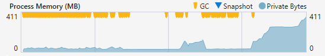
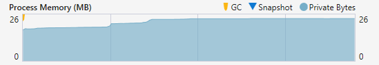

I've spend 3 days to optimize this code, including testing and measuring, and actually it is quite disappointing and depressing that massively reducing garbage collections and memory usage makes things slower...

Hereafter is the memory profiling before the optimization:

Yellow dots are when the GC kicks in, and we can see the process uses up to 411 MB of memory at peak.

Hereafter is the memory profiling after the optimization:

One yellow dot (GC kicked in) at the beginning, and we can see the process uses only 26 MB of memory at peak.

The conclusion is that, when reading from SSD and writing to HDD, both (before optimization and after optimization) are as fast as one other.

When reading from SSD and writing to the same SSD, the optimized code is much slower.

My conclusion is that a few very large reads are much faster than many small reads, when the target is a SSD.

Conclusion of the conclusion, when reading from a SSD, if you want to be fast, then fuck the memory, and fuck the GC...

\#YOLO
